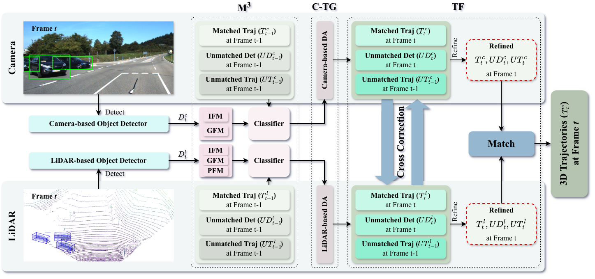

# CrossTracker: Robust Multi-Modal 3D Multi-Object Tracking via Cross Correction

> Official implementation for [**CrossTracker**](https://ieeexplore.ieee.org/abstract/document/11134483), an **online two-stage** multi-modal 3D MOT framework that shifts fusion from *detection fusion* to *trajectory fusion* via **cross correction**.
<div align="center">
  
</div>

- **M$^3$ module**: learns a robust tracking constraint by modeling **image features (IFM)**, **point cloud features (PFM)**, and **planar geometry features (GFM)**, then predicts cross-frame consistency probability.
- **Stage-1 (C-TG)**: independently generates coarse trajectories for **camera** and **LiDAR**.
- **Stage-2 (TF)**: performs **trajectory fusion** and **mutual refinement** between modalities through **cross correction**, improving robustness to false/missed detections.

---

## News
* The code of CrossTracker has been released 📌.
---

## Environment

- Python 3.8+ (recommended)
- PyTorch (CUDA optional but recommended)

### Install
Create a conda environment and install dependencies:
```bash
# step 1. clone this repo
git clone https://github.com/lipeng-gu/CrossTracker.git
cd CrossTracker

# step 2. create a conda virtual environment and activate it
conda create -n CrossTracker python=3.8 -y
conda activate CrossTracker

# step 3. install dependencies
pip install torch==2.0.0 torchvision==0.15.1 torchaudio==2.0.1 --index-url https://download.pytorch.org/whl/cu118
pip install numpy==1.19.5
pip install numba==0.53.0
pip install SharedArray==3.2.0
...

# step 3. install pcdet
python setup.py develop
```

### Dataset
Please download from the official [KITTI](https://www.cvlibs.net/datasets/kitti/eval_tracking.php) website and organize as:
```
CrossTracker
|--data/KITTI/
|---- tracking/
|––---- training/
|––------ image_02/0000/xxxx.png
|––------ velodyne/0000/xxxx.bin
|––------ calib/0000.txt
|––------ oxts/0000.txt
|––------ label_02/0000.txt
|––---- testing/
|––------ image_02/0000/xxxx.png
|––------ velodyne/0000/xxxx.bin
|––------ calib/0000.txt
|––------ oxts/0000.txt
```

## Useage
### 2) Generate the training data
```bash
python tools/kitti_gen.py
```

### 2) Train M$^3$ (multi-modal modeling)
```bash
python tools/kitti_train.py
```

### 3) Run 3D multi-object tracking
```bash
python tools/kitti_mot.py  --cfg_file configs/kitti_mot/...
```


## Citation
```bash
@ARTICLE{11134483,
  author={Gu, Lipeng and Yan, Xuefeng and Wang, Weiming and Chen, Honghua and Zhu, Dingkun and Nan, Liangliang and Wei, Mingqiang},
  journal={IEEE Transactions on Circuits and Systems for Video Technology}, 
  title={CrossTracker: Robust Multi-Modal 3D Multi-Object Tracking via Cross Correction}, 
  year={2026},
  volume={36},
  number={2},
  pages={2191-2206},
  doi={10.1109/TCSVT.2025.3601667}
}
```